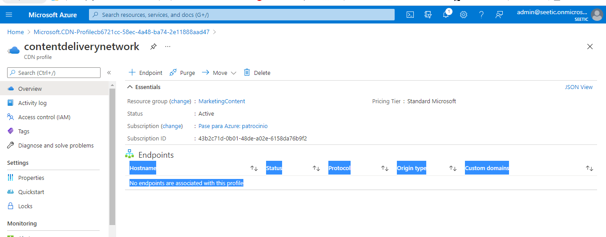

**ALUMNO**: ANTONIO DE HARO BUENO
## Lab 12

Para este laboratorio no he usado los archivos indicados. He usado otros a los que les he puesto los mismos nombres, por lo que el resultado final tiene una apariencia distinta.

